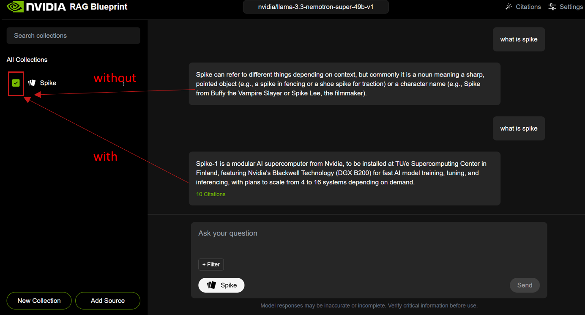

# On-Premises RAG LLM Hosting with NVIDIA AI Blueprint (SCC lunch session)

We invite you for a **hands-on lunch session** showcasing a fully operational **enterprise-level** RAG LLM deployment
running on your **own hardware**. This live demonstration will feature real document processing, interactive query
handling, and comprehensive visibility into system architecture and performance monitoring. Please also feel free to
share this opportunity with colleagues interested in private LLM hosting and implementation strategies (We can set this
up for your team **within half a day**! As long as you have the GPUs).

_Interactive demonstration with lunch provided!_ Researchers are also welcome to join! We look forward to your feedback.

<!-- more -->

{ align=right width=100px }

Registration quickly at [https://forms.office.com/e/ZdUMiUJHGZ?origin=lprLink](https://forms.office.com/e/ZdUMiUJHGZ?origin=lprLink){ target=_blank } as it helps us prepare adequate catering.
To avoid waste, please let us know if you want to cancel your registration.

Questions? Contact [supercomputing@tue.nl](mailto:supercomputing@tue.nl)

## 🎯 Key Propositions

<figure markdown style="float: right;">
  { width=300px align=top }
  <figcaption>Example using RAG AI Enterprise, asking question about spike with/without selecting the relevant pdf. (Spike-1 is a NVIDIA DGX B200 system TU/e bought)</figcaption>
</figure>

- **Complete Solution Out-of-the-Box**:
    Pre-integrated 15+ enterprise components including document processing, vector databases, embedding models, and multimodal AI capabilities
- **Superior Performance**:
    2x improved throughput (1,201 vs 613 tokens/sec), 15x faster multimodal data extraction, and 50% fewer incorrect answers compared to traditional implementations
- **Multimodal Intelligence**:
    Advanced capabilities to understand and process text, tables, charts, images, and audio files from enterprise documents
- **On-Premises Control**:
    Full data sovereignty with enterprise-grade security, compliance, and customization while leveraging NVIDIA's optimized AI stack
- **Low Cost But Up-to-date**:
    Only requires hardware spending and maintenance efforts are low.
