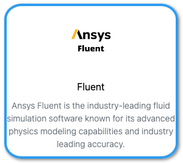

[ANSYS Fluent](https://www.ansys.com/products/fluids/ansys-fluent){:target="_blank"} is the industry-leading fluid simulation software known for its advanced physics modeling capabilities and industry leading accuracy

## Using ANSYS Fluent interactive<br>(Graphical User Interface)

{: allign=right style="height:100px"}
Use your browser to connect to [Umbrella On Demand](https://hpc.tue.nl){:target="_blank"}

## Using ANSYS Fluent in SLURM batch jobs<br>(Command Line Interface)

### Test ANSYS Fluent

Load the module(s)

```shell 
[user@umbrella]$ module purge
[user@umbrella]$ module load foss/2024a # or intel/2024a for -mpi=intel)
[user@umbrella]$ module load ANSYS/2025R1
```

Check ANSYS Fluent:

```shell 
[user@umbrella]$ fluent 3ddp -g -t2 -mpitest -mpi=openmpi

FLUENT MPI test started ... 

Ping pong latency test ...
ping..pong..latency(usec)...count..host
-------------------------------------------------------------
0.....1.....0.29906.........10000..0:tue-login002.icts.tue.nl
1.....0.....0.296366........10000..1:tue-login002.icts.tue.nl

Ping pong bandwidth test ...
ping..pong..bandwidth(MB)...count.msg-size(MB)..host
-------------------------------------------------------------
0.....1.....6049.28.........10....4.............0:tue-login002.icts.tue.nl
1.....0.....5543.97.........10....4.............1:tue-login002.icts.tue.nl

Global reduction test ...
MPI-function...time-per-msg(usec)..count...total-time(sec)..
-------------------------------------------------------------
Bcast..........0.194028............5000....0.000970142......
Reduce.........0.22126.............5000....0.0011063........
Barier.........0.308314............5000....0.00154157.......

FLUENT MPI test done.

```

### ANSYS Fluent SLURM sbatch jobscript example using OpenMPI on 1 Node.

```slurm
#!/bin/bash
#
#SBATCH --job-name=test_ansys
#SBATCH --error=test_ansys-%j.log
#SBATCH --partition=tue.default.q
#SBATCH --nodes=1
#SBATCH --ntasks-per-node=8
#SBATCH --cpus-per-task=1
#SBATCH --mem-per-cpu=2gb
#SBATCH --time=00:05:00

module purge
module load foss/2024a
module load ANSYS/2025R1

fluent 3ddp -g -t${SLURM_NTASKS} -mpitest -mpi=openmpi
```

### ANSYS Fluent SLURM sbatch jobscript example using OpenMPI on 2 Nodes.
```slurm
#!/bin/bash
#
#SBATCH --job-name=test_ansys
#SBATCH --error=test_ansys-%j.log
#SBATCH --partition=tue.default.q
#SBATCH --nodes=2
#SBATCH --ntasks-per-node=8
#SBATCH --cpus-per-task=1
#SBATCH --mem-per-cpu=2gb
#SBATCH --time=00:05:00

module purge
module load foss/2024a
module load ANSYS/2025R1

JOB_NODES="$(scontrol show hostnames)"
JOB_NODES=$(echo ${JOB_NODES} | tr ' ' ',')

fluent 3ddp -g -cnf=${JOB_NODES} -t${SLURM_NTASKS} -mpitest -mpi=openmpi
```
