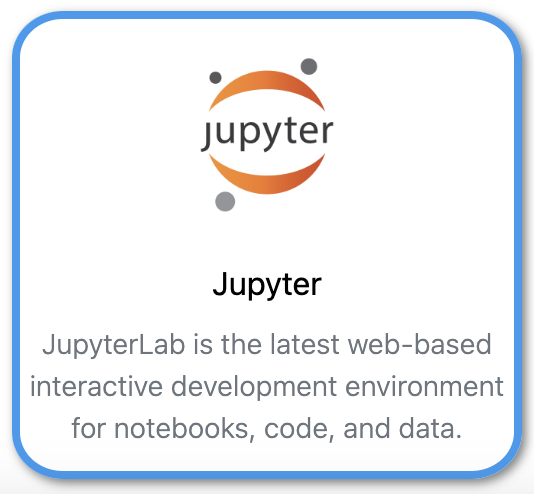

[Jupyter](https://jupyter.org/){:target="_blank"} Jupyter(Lab) is the latest web-based interactive development environment for notebooks, code, and data. Its flexible interface allows users to configure and arrange workflows in data science, scientific computing, computational journalism, and machine learning.

## Using Jupyter interactive<br>(Graphical User Interface)

{: text-align=center style="height:100px"}
Use your browser to connect to [Umbrella On Demand](https://hpc.tue.nl){:target="_blank"}

## Using Jupyter in SLURM batch jobs<br>(Command Line Interface)

As Jupyter is an Interactive Development Environment, running it as a batch job in SLURM is not very useful. Running the Python code developed at scale is: [Python Recipes](python.md).

### Jupyter SLURM sbatch jobscript example using 1 GPU and 1 CPU

```slurm
#!/bin/bash

#SBATCH --job-name=my_job
#SBATCH --output=my_job_output_%j.txt
#SBATCH --partition=tue.gpu.q         # Choose a partition that has GPUs
#SBATCH --time=1:00:00
#SBATCH --nodes=1
#SBATCH --ntasks-per-node=1
#SBATCH --cpus-per-task=1
#SBATCH --mem-per-cpu=2G
#SBATCH --gpus=1                      # This is how to request a GPU

# Load the module that can run Jupyter Notebooks

module load jupyter-server/2.7.2-GCCcore-12.3.0

# Load modules or software if needed optimized for GPU use if available
# In the example PyTorch is made available for import into MyJupyterNotebook.ipynb

module load PyTorch/2.1.2-foss-2023a-CUDA-12.1.1

# Run the complete jupyter notebook file
jupyter nbconvert --to notebook --execute MyJupyterNotebook.ipynb 
```