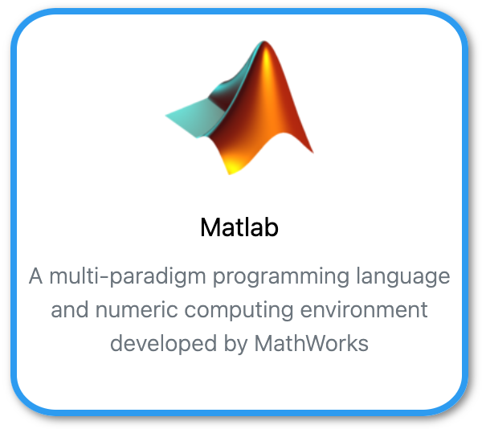

{: align=right style="height:100px"}
[MATLAB](https://nl.mathworks.com/products/matlab.html){:target="_blank"} by MathWorks is a programming and numeric computing platform used by millions of engineers and scientists to analyze data, develop algorithms, and create models.

[MATLAB Basic Functions Reference](matlab-basic-functions-reference.pdf)

## Using MATLAB interactive<br>(Graphical User Interface)

Use your browser to connect to [Umbrella On Demand](https://hpc.tue.nl){:target="_blank"}

## Using MATLAB in SLURM batch jobs<br>(Command Line Interface)

### Test MATLAB

Load the module(s)

```shell 
[user@umbrella]$ module purge
[user@umbrella]$ module load MATLAB/2024b
```

Check if the licenses are available:

```shell
[user@umbrella]$ matlab -dmlworker -nodisplay -singleCompThread -r "ver -support;exit"
```

Output to screen should start with: 
```output
-----------------------------------------------------------------------------------------------------
MATLAB Version: 24.2.0.2712019 (R2024b)
MATLAB License Number: 284992
Operating System: Linux 4.18.0-553.16.1.el8_10.x86_64 #1 SMP Thu Aug 8 17:47:08 UTC 2024 x86_64
Java Version: Java 1.8.0_202-b08 with Oracle Corporation Java HotSpot(TM) 64-Bit Server VM mixed mode
-----------------------------------------------------------------------------------------------------
MATLAB                                                Version 24.2        (R2024b)      License 284992
```

Check the GPU(s) available. This command only gives output on nodes with GPU (MIG GPU(s) throw an Error)) installed and when requested:

```gpuDeviceTable```

### MATLAB SLURM sbatch jobscript example using 1 CPU

```slurm
#!/bin/bash
#SBATCH --job-name=test_matlab
#SBATCH --output=test_matlab-%j.log
#SBATCH --partition=tue.default.q
#SBATCH --nodes=1
#SBATCH --ntasks=1
#SBATCH --cpus-per-task=1
#SBATCH --mem-per-cpu=2gb
#SBATCH --time=00:05:00

module purge
module load MATLAB/2024b

matlab -nodisplay -nosplash -nodesktop -r simple
```

??? example "simple.m"
  
    ```matlab

    a=1;
    b=2;
    disp (a + b);
    exit;
    ```

### MATLAB SLURM sbatch jobscript example using 8 CPU

MATLAB by default creates a parpool("Processes") using the available CPUs (--cpus-per-task).

```slurm
#!/bin/bash
#SBATCH --job-name=test_matlab
#SBATCH --output=test_matlab-%j.log
#SBATCH --partition=tue.default.q
#SBATCH --nodes=1
#SBATCH --ntasks=1
#SBATCH --cpus-per-task=8
#SBATCH --mem-per-cpu=2gb
#SBATCH --time=00:05:00

module purge
module load MATLAB/2024b

matlab -batch parallel
```

??? example "parallel.m"
  
    ```matlab

    parfor idx = 1:8
        pause(10);
    end
    exit;
    ```

