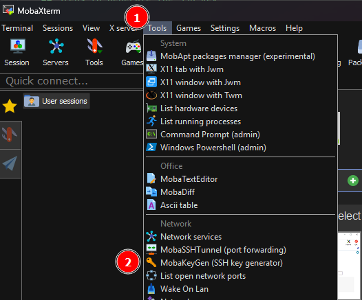
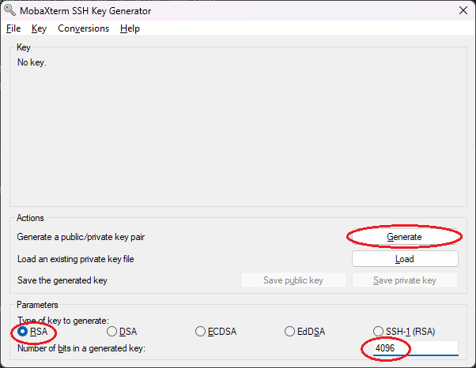
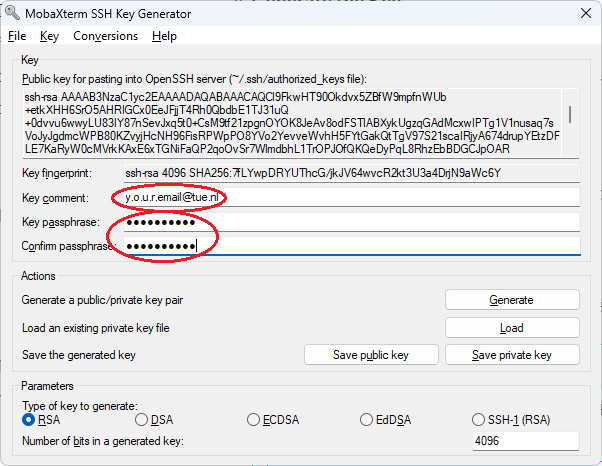

<div class="stepper-wrapper">
  <div class="stepper-item completed">
    <div class="step-counter">1</div>
    <div class="step-name"><a href="../step-1/">Prerequisites</a></div>
  </div>
  <div class="stepper-item active">
    <div class="step-counter">2</div>
    <div class="step-name">Generate Keypair</div>
  </div>
  <div class="stepper-item">
    <div class="step-counter">3</div>
    <div class="step-name">Using Public Keys</div>
  </div>
  <div class="stepper-item">
    <div class="step-counter">4</div>
    <div class="step-name">Using Private Keys</div>
  </div>
  <div class="stepper-item">
    <div class="step-counter">5</div>
    <div class="step-name">Completed</div>
  </div>
</div>

# Step 2: Generating an SSH Key Pair

=== ":fontawesome-brands-windows: Windows"

    === ":octicons-terminal-16: MobaXterm"

        This guide provides step-by-step instructions to generate an SSH key pair on Windows using MobaXterm's built-in MobaKeygen tool, which simplifies the process of creating SSH keys without the command line.
    
        ## Steps to Generate the SSH Key:
    
        1. **Open MobaXterm**: 
    
            Launch the MobaXterm application from your Windows Start Menu or desktop shortcut.
    
        2. **Access MobaKeygen**:
    
            - In MobaXterm, click on the "Tools" menu in the top menu bar.
            - Select **MobaKeygen (SSH Key Generator)** from the dropdown list to open the key generator tool.
    
                { width=200 }
    
        3. **Configure Key Settings**:
    
            { align=right width=350 }
    
            - In the MobaKeygen window, ensure the following settings are selected:
            - **Key Type**: Select **RSA**.
            - **Number of bits**: Set to **4096** for high security.
    
        4. **Generate the Key**:
    
            - Click on the **Generate key** button.
            - Move your mouse around the blank area below the progress bar to generate randomness for the key.
    
        5. **Set the Key Comment**:
    
            { align=right width=350 }
        
            Once the key is generated, you can set a comment to label the key, typically with your email address (e.g., `y.o.u.r.email@tue.nl`), by entering it in the provided field.
    
        6. **Set a Passphrase**:
    
            In the *Key passphrase* field, you should enter a passphrase for additional security. Re-enter it in the *Confirm passphrase* field.
    
            !!! tip "Passphrase"
            
                Always aim to use a passphrase to secure your SSH keys unless you absolutely must prioritize seamless automation. Even then, evaluate other security controls to mitigate risks.
    
                ??? abstract "Considerations"
        
                    When generating an SSH key pair, you are given the option to set a passphrase. Setting a passphrase provides an additional layer of security by encrypting your private key on disk. This means that even if someone gains access to your private key file, they cannot use it without the passphrase.
                    
                    **Why You Should Use a Passphrase:**
        
                    - **Enhanced Security**: Protects your private key from unauthorized use.
                    - **Data Protection**: Even if your device is compromised, a passphrase ensures that the private key remains secure.
                    - **Compliance and Policies**: Many organizations and services require private keys to be passphrase-protected as part of their security policies.
                    
                     **When to Consider Skipping**:
        
                    - **Automation**: In specific use cases, such as automated systems or scripts where human interaction is not feasible, you might consider omitting a passphrase. This should be done with extreme caution and additional security measures (like securing the file with appropriate permissions) should be in place. 
                
        7. **Save the Keys**:
    
            Once the key is generated, you will have options to save your keys.
        
            - **Save and Format the Public Key Locally**: 
        
                Click **Save public key** to save the file, typically as `id_rsa.pub`. However, to ensure the key format is correct:
              
                1. Open the saved `id_rsa.pub` file in **Notepad** (or another text editor).
        
                2. Copy the entire text content from this file, which should start with `ssh-rsa` and end with your key comment (e.g., `ssh-rsa AAAAB3... y.o.u.r.email@tue.nl`).
        
                3. Save (overwrite) the existing file by saving it (File > Save) to ensure the changes are written to the file.
        
            - **Save Private Key**: 
        
                Click **Save private key** to save your **Private Key (:material-key:)**, typically saved as `id_rsa`. **_Never_** share this file; keep it secure at all times.

    === ":material-powershell: PowerShell"

        To generate an SSH key pair on Windows using OpenSSH with RSA encryption and a 4096-bit key size, including an email identifier, follow these steps:
    
        ## Steps to Generate the SSH Key:
        
        1. **Open PowerShell**:
    
            You can start PowerShell by searching for it in the Start Menu and selecting it, by pressing **Win + X** and choosing "Windows PowerShell" from the menu.
        
        2. **Execute the SSH Keygen Command**: 
    
            Copy and paste the command below into PowerShell, replacing the email with your own:
    
            ```powershell
            ssh-keygen -t rsa -b 4096 -C "your.email@example.com"
            ```
    
            ??? abstract "Explanation of Command Options"
        
                - **`ssh-keygen`**: Command to create, manage, and convert authentication keys for SSH.
                - **`-t rsa`**: Specifies RSA as the type of key.
                - **`-b 4096`**: Indicates a 4096-bit key for high security.
                - **`-C "your.email@example.com"`**: Adds a comment (label) for the key, typically the user’s email address. Replace this with your own email.
    
        3. **Choose a File Location**:
    
            When prompted, press Enter to save the key in the default location (`C:\Users\YourUsername\.ssh\id_rsa`), or specify another path.
    
        4. **Set a Passphrase**:
    
            You will be asked to enter a passphrase. It is recommended to add one for additional security. Enter a passphrase and press Enter.
    
            !!! tip "Passphrase"
            
                Always aim to use a passphrase to secure your SSH keys unless you absolutely must prioritize seamless automation. Even then, evaluate other security controls to mitigate risks.
    
                ??? abstract "Considerations"
        
                    When generating an SSH key pair, you are given the option to set a passphrase. Setting a passphrase provides an additional layer of security by encrypting your private key on disk. This means that even if someone gains access to your private key file, they cannot use it without the passphrase.
                    
                    **Why You Should Use a Passphrase:**
        
                    - **Enhanced Security**: Protects your private key from unauthorized use.
                    - **Data Protection**: Even if your device is compromised, a passphrase ensures that the private key remains secure.
                    - **Compliance and Policies**: Many organizations and services require private keys to be passphrase-protected as part of their security policies.
                    
                     **When to Consider Skipping**:
        
                    - **Automation**: In specific use cases, such as automated systems or scripts where human interaction is not feasible, you might consider omitting a passphrase. This should be done with extreme caution and additional security measures (like securing the file with appropriate permissions) should be in place. 
                
        5. **Completion**: 
    
            After confirming the passphrase, your SSH key pair, **Public Key** and **Private Key**, will be generated and saved to the specified directory:
    
            - **Public Key**: `C:\Users\YourUsername\.ssh\id_rsa.pub`
            - **Private Key**: `C:\Users\YourUsername\.ssh\id_rsa` — **_Never_** share this file. Keep it secure at all times.

=== ":fontawesome-brands-linux: Linux"
    
    To generate an SSH key pair on Linux using RSA encryption with a 4096-bit key size and including an email identifier, follow these steps:

    ## Steps to Generate the SSH Key:
    
    1. **Open Terminal**: 

        Launch the Terminal by navigating to **Applications > Utilities > Terminal**, or use Spotlight Search (⌘ + Space) and type "Terminal," then hit Enter.
    
    2. **Execute the SSH Keygen Command**: 

        Copy and paste the command below into the terminal, replacing the email with your own:

        ```bash
        ssh-keygen -t rsa -b 4096 -C "your.email@example.com"
        ```

        ??? abstract "Explanation of Command Options"
    
            - **`ssh-keygen`**: Command to create, manage, and convert authentication keys for SSH.
            - **`-t rsa`**: Specifies RSA as the type of key.
            - **`-b 4096`**: Indicates a 4096-bit key for high security.
            - **`-C "y.o.u.r.email@tue.nl"`**: Adds a comment (label) for the key, typically the user’s email address. Replace this with your own email.

    3. **Choose a File Location**:

        When prompted, press Enter to save the key in the default location (`/home/yourusername/.ssh/id_rsa`), or specify another path.

    4. **Set a Passphrase**:

        You will be asked to enter a passphrase. It is recommended to add one for additional security. Enter a passphrase and press Enter.

        !!! tip "Passphrase"
        
            Always aim to use a passphrase to secure your SSH keys unless you absolutely must prioritize seamless automation. Even then, evaluate other security controls to mitigate risks.

            ??? abstract "Considerations"
    
                When generating an SSH key pair, you are given the option to set a passphrase. Setting a passphrase provides an additional layer of security by encrypting your private key on disk. This means that even if someone gains access to your private key file, they cannot use it without the passphrase.
                
                **Why You Should Use a Passphrase:**
    
                - **Enhanced Security**: Protects your private key from unauthorized use.
                - **Data Protection**: Even if your device is compromised, a passphrase ensures that the private key remains secure.
                - **Compliance and Policies**: Many organizations and services require private keys to be passphrase-protected as part of their security policies.
                
                 **When to Consider Skipping**:
    
                - **Automation**: In specific use cases, such as automated systems or scripts where human interaction is not feasible, you might consider omitting a passphrase. This should be done with extreme caution and additional security measures (like securing the file with appropriate permissions) should be in place. 
            
    5. **Completion**: 

        After confirming the passphrase. Your SSH key pair, **Public Key (:material-lock:)** and **Private Key (:material-key:)** will be generated and saved to the specified directory:

        - **Public Key (:material-lock:)**: `/home/yourusername/.ssh/id_rsa.pub`
        - **Private Key (:material-key:)**: `/home/yourusername/.ssh/id_rsa` — **_Never_** share this file. Keep secure at all time.

=== ":fontawesome-brands-apple: MacOS"

    To generate an SSH key pair on macOS, using RSA encryption with a 4096-bit key size and including an email identifier, follow these steps:

    ## Steps to Generate the SSH Key:

    1. **Open Terminal**:
        
        Press `Command (⌘) + Space` to open Spotlight Search, type "Terminal," and press Enter.

    2. **Execute the SSH Keygen Command**:

        Copy and paste the command below into the Terminal, replacing the email with your own:

        ```bash
        ssh-keygen -t rsa -b 4096 -C "your.email@example.com"
        ```

        ??? abstract "Explanation of Command Options"
    
            - **`ssh-keygen`**: Command to create, manage, and convert authentication keys for SSH.
            - **`-t rsa`**: Specifies RSA as the type of key.
            - **`-b 4096`**: Indicates a 4096-bit key for high security.
            - **`-C "y.o.u.r.email@tue.nl"`**: Adds a comment (label) for the key, typically the user’s email address. Replace this with your own email.

    3. **Choose a File Location**:

        When prompted, press Enter to save the key in the default location (`/Users/yourusername/.ssh/id_rsa`), or specify another path.
    
    4. **Set a Passphrase**:

        You will be asked to enter a passphrase. It is recommended to add one for additional security. Enter a passphrase and press Enter.

        !!! tip "Passphrase"
        
            Always aim to use a passphrase to secure your SSH keys unless you absolutely must prioritize seamless automation. Even then, evaluate other security controls to mitigate risks.

            ??? abstract "Considerations"
    
                When generating an SSH key pair, you are given the option to set a passphrase. Setting a passphrase provides an additional layer of security by encrypting your private key on disk. This means that even if someone gains access to your private key file, they cannot use it without the passphrase.
                
                **Why You Should Use a Passphrase:**
    
                - **Enhanced Security**: Protects your private key from unauthorized use.
                - **Data Protection**: Even if your device is compromised, a passphrase ensures that the private key remains secure.
                - **Compliance and Policies**: Many organizations and services require private keys to be passphrase-protected as part of their security policies.
                
                 **When to Consider Skipping**:
    
                - **Automation**: In specific use cases, such as automated systems or scripts where human interaction is not feasible, you might consider omitting a passphrase. This should be done with extreme caution and additional security measures (like securing the file with appropriate permissions) should be in place. 
            
    5. **Completion**:

        After confirming the passphrase. Your SSH key pair, **Public Key (:material-lock:)** and **Private Key (:material-key:)** will be generated and saved to the specified directory:

        - **Public Key (:material-lock:)**: `/Users/yourusername/.ssh/id_rsa.pub` 
        - **Private Key (:material-key:)**: `/Users/yourusername/.ssh/id_rsa` — **_Never_** share this file. Keep secure at all time.

!!! success "Next step"

    After following all the provided instructions of this step you succesfully created an SSH Key Pair. Congratulations!

    In the next step of this guide we'll continue with adding the generated **Public Key (:material-lock:)** to the **Server (:material-home:)**.

[Continue](step-3.md){ .md-button .md-button--primary }
