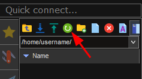

<div class="stepper-wrapper">
  <div class="stepper-item completed">
    <div class="step-counter">1</div>
    <div class="step-name"><a href="../step-1/">Prerequisites</a></div>
  </div>
  <div class="stepper-item completed">
    <div class="step-counter">2</div>
    <div class="step-name"><a href="../step-2/">Generate Keypair</a></div>
  </div>
  <div class="stepper-item active">
    <div class="step-counter">3</div>
    <div class="step-name">Using Public Keys</div>
  </div>
  <div class="stepper-item">
    <div class="step-counter">4</div>
    <div class="step-name">Using Private Keys</div>
  </div>
  <div class="stepper-item">
    <div class="step-counter">5</div>
    <div class="step-name">Completed</div>
  </div>
</div>

# Step 3: Uploading public key

In the previous step we've created your **public (:material-lock:)** and **private (:material-key:)** keypair. In this 
step we'll focus on the **public (:material-lock:)** key and on how to install this on the **Server (:material-home:)**.

=== ":fontawesome-brands-windows: Windows"

    === ":octicons-terminal-16: MobaXterm"

        We previously created an SSH key pair using MobaXterm. Now, we'll upload the **Public Key (:material-lock:)** to the 
        remote **Server (:material-home:)**: `hpc.tue.nl`, to enable key-based authentication.
    
        ## Steps to Upload Your SSH Public Key:
    
        1. **Open MobaXterm**:
    
            Open MobaXterm by double-clicking its icon on your desktop or finding it in your Start menu, or by continuing with an existing session if one is already open.
    
        2. **Connect to the Remote System**:
    
            Start an SSH session in MobaXterm:
    
            1. Click on the "Session" button in the top menu.
            2. Choose "SSH" from the session type options.
            3. Enter the following details:
                - **Remote host**: `hpc.tue.nl`
                - **Username**: Enter your username for the server.
            4. Click "OK" to connect using your current password credentials.
    
        3. **Prepare the `.ssh` directory on the Server (:material-home:)**:
    
            Once connected, ensure the `.ssh` directory exists:
    
            ```bash
            mkdir -p ~/.ssh
            ```
    
        4. **Transfer the Public Key (:material-lock:)**:
    
            - After establishing the connection, MobaXterm will display a file navigator on the left side.
            - Use this file navigator to find your public key file, `id_rsa.pub`, on your local machine in the location you saved it during the Generate Keypair (2) step.
            - Drag and drop the `id_rsa.pub` file into the `.ssh` directory located within your home folder on the remote server.
    
                ??? question "Are you not seeing the `.ssh` folder in the file navigator?"
        
                    Ensure you've performed previous step:
                    ```bash
                    mkdir -p ~/.ssh
                    ```
    
                    If you still don't see the `.ssh` directory click on the `Refresh Folders` (:material-refresh:) button:
    
                    
    
        5. **Add the Public Key (:material-lock:) to `authorized_keys`**:
    
            - In the SSH terminal, append the public key to the `authorized_keys` file:
                ```bash
                cat ~/.ssh/id_rsa.pub >> ~/.ssh/authorized_keys
                ```
            - Alternatively, open the `authorized_keys` file in an editor and paste the contents of `id_rsa.pub`.
    
        6. **Set Correct Permissions**:
    
            Set appropriate permissions for the `.ssh` directory and `authorized_keys` file:
    
            ```bash
            chmod 700 ~/.ssh
            chmod 600 ~/.ssh/authorized_keys
            ```

    === ":material-powershell: PowerShell"

        We previously created an SSH key pair using a terminal on Windows. Now, we'll upload the **Public Key (:material-lock:)**
        to the remote **Server (:material-home:)**: `hpc.tue.nl`, to enable key-based authentication.
        
        ## Steps to Upload Your SSH Public Key:
    
        1. **Open PowerShell**:
    
            You can start PowerShell by searching for it in the Start Menu and selecting it, by pressing **Win + X** and choosing "Windows PowerShell" from the menu, or by continuing with an existing session if one is already open.
    
        2. **Use `scp` or manually copy the Public Key (:material-lock:)**:
    
            Unlike `ssh-copy-id` available on Linux, on Windows, you typically use `scp` to manually copy the public key over to the server:
    
            ```powershell
            scp C:\Users\yourusername\.ssh\id_rsa.pub username@hpc.tue.nl:~/
            ```
    
            Replace `yourusername` with your Windows username and `username` with your actual username on the server. This command will securely copy your public key (`C:\Users\yourusername\.ssh\id_rsa.pub`) to your home directory on the remote server.
    
        3. **Append the Public Key to `authorized_keys` on the Server**:
    
            After copying the key, you'll need to log in to the remote server to append your public key to the `authorized_keys` file:
    
            ```bash
            ssh username@hpc.tue.nl
            ```
    
            Once logged in, execute the following commands:
    
            ```bash
            mkdir -p ~/.ssh
            cat ~/id_rsa.pub >> ~/.ssh/authorized_keys
            rm ~/id_rsa.pub
            chmod 600 ~/.ssh/authorized_keys
            chmod 700 ~/.ssh
            ```
    
            These commands will ensure that your public key is added to the `authorized_keys` file and that the permissions are set correctly for SSH key-based authentication.

=== ":fontawesome-brands-linux: Linux"

    We previously created an SSH key pair using a terminal on Linux. Now, we'll upload the **Public Key (:material-lock:)** 
    to the remote **Server (:material-home:)**: `hpc.tue.nl`, to enable key-based authentication.

    ## Steps to Upload Your SSH Public Key:

    1. **Open a Terminal**:

        Start your terminal application. You can typically find it in the application menu or use a keyboard shortcut (e.g., `Ctrl + Alt + T` on some systems), or by continuing with an existing session if one is already open.

    2. **Use `ssh-copy-id` to Transfer the Public Key (:material-lock:)**:

        Use the `ssh-copy-id` command to transfer your SSH **Public Key (:material-lock:)** from its default location to the remote **Server (:material-home:)**, `hpc.tue.nl`:

        ```bash
        ssh-copy-id -i /home/yourusername/.ssh/id_rsa.pub username@hpc.tue.nl
        ```

        Replace `username` with your actual username on the server. 
        This command will securely copy your public key (`/home/yourusername/.ssh/id_rsa.pub`) to the remote server and append it to the `authorized_keys` file automatically.

=== ":fontawesome-brands-apple: MacOS"

    We previously created an SSH key pair using the Terminal on macOS. Now, we'll upload the **Public Key (:material-lock:)** 
    to the remote **Server (:material-home:)**: `hpc.tue.nl`, to enable key-based authentication. 

    ## Steps to Upload Your SSH Public Key:

    1. **Open a Terminal**:

        Launch the Terminal by navigating to **Applications > Utilities > Terminal**, or use Spotlight Search (⌘ + Space) and type "Terminal," then hit Enter, or by continuing with an existing session if one is already open.

    2. **Use `ssh-copy-id` to Transfer the Public Key (:material-lock:)**:

        Use the `ssh-copy-id` command to transfer your SSH **Public Key (:material-lock:)** from its default location to the remote **Server (:material-home:)**, `hpc.tue.nl`:

        ```bash
        ssh-copy-id -i /Users/yourusername/.ssh/id_rsa.pub username@hpc.tue.nl
        ```

        Replace `username` with your actual username on the server. 
        This command will securely copy your public key (`/Users/yourusername/.ssh/id_rsa.pub`) to the remote server and append it to the `authorized_keys` file automatically.

!!! success "Next step"

    After following all the provided instructions of this step you succesfully added your **Public Key (:material-lock:)** to the **Server (:material-home:)**. Congratulations!

    In the next step of this guide we'll continue with using the earlier generated **Private Key (:material-key:)** to access the **Server (:material-home:)**.


[Continue](step-4.md){ .md-button .md-button--primary }
