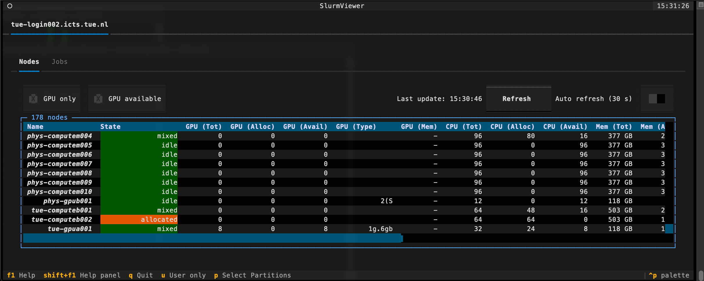

# Slurm Viewer

Slurm Viewer (**slurm-viewer**) is a Graphical Command Line Interface to the Slurm Schduler. View the status of a SLURM cluster, including nodes and patitions/queues. It is avaialbe as a [module](https://supercomputing.tue.nl/documentation/steps/software/) on the login node and needs initialisation once.

Load the module

```shell
user@umbrella$ module load SlurmViewer
```

Initialise SlurmViewer, only needed once, after this edit `~/.config/slurm-viewer/settings.toml`

```shell
user@umbrella$ slurm-viewer-init
```

Start SlurmViewer

```shell
user@umbrella$ slurm-Viewer
```

