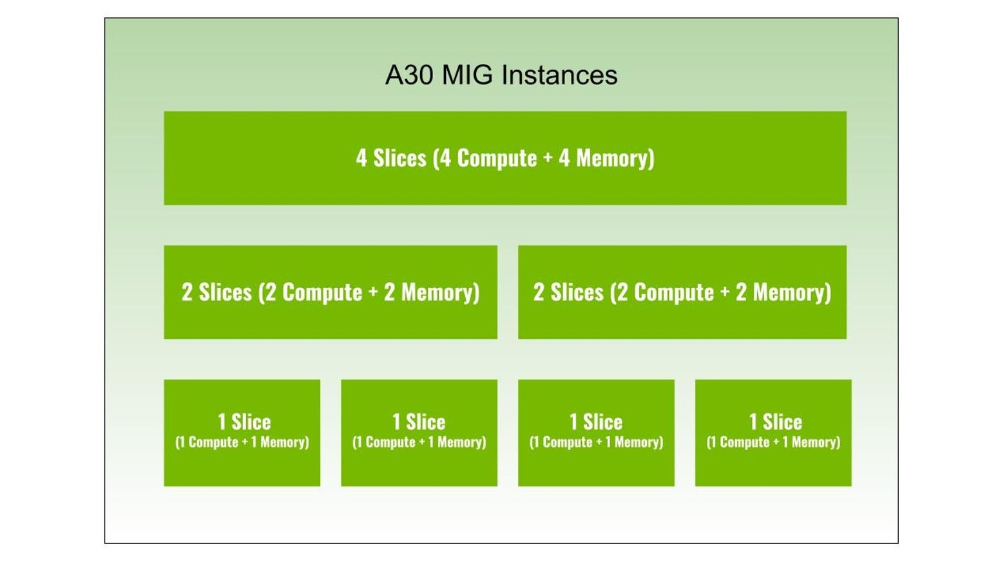

Some nodes are equipped with GPU(s) that support MIG.  As the MIG settings are not reboot safe (MIG enable/disable is), the nvidia-mig-manager systemd service is used to keep the MIG setting across reboots. nvidia-mig-manager uses mig-parted (https://github.com/NVIDIA/mig-parted)

{ align=center heigth="200" }

On hpc-head01:

Prepare the node image:

```shell
lchroot gpu
dnf -y install https://github.com/NVIDIA/mig-parted/releases/download/v0.5.5/nvidia-mig-manager-0.5.5-1.x86_64.rpm
exit
luna osimage pack gpu
```

The systemd needs a override with the correct setting (a 10 seconds sleep is added to allow the kernel to load the nvidia modules before starting).
NOTE: these setting can/are part of the **luna post**.txt
``` shell
cat > /etc/systemd/system/nvidia-mig-manager.service.d/override.conf << EOF
[Unit]
Before=slurmd.service
[Service]
ExecStartPre=/bin/sleep 10
Environment="MIG_PARTED_SELECTED_CONFIG=all-1g.6gb"
EOF
```

## GPU Nodes that have enable MIG:

tue-gpua001 (A30)

bme-gpue001 (A30)


### Doing the MIG settings without nvidia-mig-manager:
```shell
nvidia-smi -mig 1 # reboot safe
nvidia-smi mig -cgi 14,14,14,14 -C # removed after reboot
```

