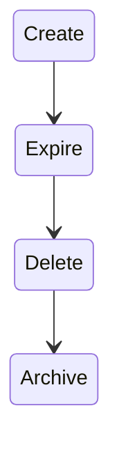

# User Management

## Create Users

### Usage

Typically, the following command is used to create a user:
```shell
usercreate <username> [group ...]
```

1. `username` is either a valid e-mail address or username
2. `group` is usually the group(s) the user need to be added to, i.e. `phys-tps`. If omitted the user will only be added to the `umbrella` "user" group.


Full help:
```shell
usage: usercreate [-h] [-e EXPIRE] [-d DIR] [-m] [-y] [-q QUOTA]
                  USERNAME [GROUP [GROUP ...]]

Create user.

positional arguments:
  USERNAME    Username
  GROUP       Groups

optional arguments:
  -h, --help  show this help message and exit
  -e EXPIRE   Number of days or date (YYYY-mm-dd) after which the account
              expires. Set to -1 to disable
  -d DIR      Configure home dir location
  -m          Do not sent an e-mail upon creation
  -y          Automatically answer yes for all questions (non-
              interactive/batch mode)
  -q QUOTA    User storage quota
```

## Query Users

### Usage

Full help:
```shell
usage: userquery [-h] [-R] QUERY

Query user.

positional arguments:
  QUERY       Username and/or E-Mail address (support globs)

optional arguments:
  -h, --help  show this help message and exit
  -R, --raw   Raw JSON output
```

## Create/modify groups

We use `obol` for this; see commands below.

### Naming scheme

We use the following naming scheme for user-managed groups:

```
[dept[-group[-subgroup]]]
```

with

* `dept` the department that owns the POSIX group
* `group` the research group that owns the POSIX group (optional)
* `subgroup` the group within the research that owns the POSIX group (optional)

Examples:

```
elec-ees-empso  ->  POSIX group representing a subgroup within the electrical engineering department
```

### Commands

```
obol group add {group}
obol group delete {group}

obol group addusers {group} {user} [user ...]
obol group delusers {group} {user} [user ...]

obol group show {group}
```



