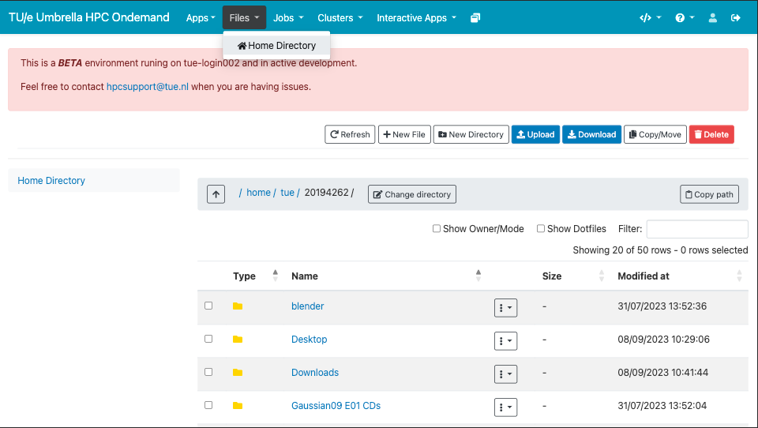
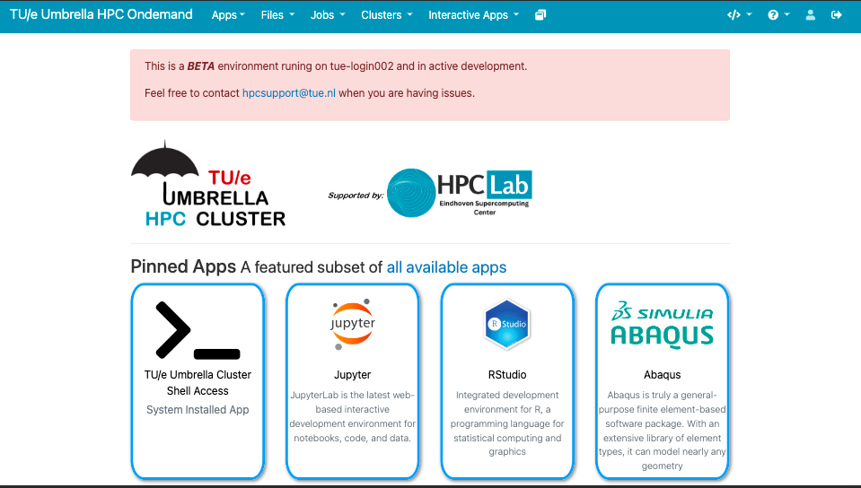

# Access the cluster

The TU/e Umbrella HPC Cluster is an UNIX-based (Linux) environment with shell (commandline) access.
To log in, one usually uses SSH to reach the respective Login Nodes (computers reserved for people just like you that want to connect to the HPC Cluster). This access is restricted, so you can only connect, when you are within the university/facility and its network. To still access the Login Nodes externally, one can 'pretend to be inside the network' by using the TU/e provided Virtual Private Network (VPN).
 
Once there, the user can interact with the system and run (small) programs to generally test the system/software.

This page describes how to connect to the cluster making novice users
more familiar with \`CLI\` and \`SSH\` concepts.

## GUI

### Open OnDemand

{ align=right width=250px }
Based on [openondemand.org](https://openondemand.org/){:target=_blank} easy access to the TU/e Umbrella HPC Cluster is possible using a web browser. To get started visit [hpc.tue.nl](https://hpc.tue.nl){:target=_blank} and login with your TU/e credentials.

<br/>

#### Terminal in the Browser

{ align=right width=250px }
Terminal access to the cluster login-node available from the browser, no longer client software is needed (other than a modern web browser) to take your first steps on the cluster!

<br/>

#### Upload and Download Files

{ align=right width=250px }
Access to the files with upload and download capabilities, in your home-directory on the cluster via the browser.

<br/><br/>

#### Interactive Graphical Jobs

{ align=right width=250px }
Start interactive jobs in your browser with a few clicks and interact
within your browser.

<br/><br/><br/><br/>

<p style="text-align: center; font-style: italic">various examples with Jupyter, Paraview and Matlab respectively.</p>
{ width=225px }
{ width=225px }
{ width=225px }

!!! remark
    This article is partially based on a [GitHub help article](https://help.github.com/en/github/authenticating-to-github/generating-a-new-ssh-key-and-adding-it-to-the-ssh-agent){:target=_blank}

## Command Line

### Necessary tools

HPC clusters that are most commonly operated via a [\`Command Line
Interface\`
(CLI)](https://en.wikipedia.org/wiki/Command-line_interface).

Such a CLI can be accessed directly by attaching a monitor and keyboard
to the cluster itself locally to create an operational "terminal",
however it is more common to operate HPC clusters remotely over the
(inter)network through [\`Secure SHell\`
(SSH)](https://en.wikipedia.org/wiki/Secure_Shell) using a [Terminal
Emulators](https://en.wikipedia.org/wiki/Terminal_emulator), as HPC
clusters are usually geographically inconveniently located for their
users.

GNU/Linux and MacOS systems are usually equipped with powerful SSH tools
by default out of the box. Microsoft Windows users can install openSSH
on windows
[1](https://docs.microsoft.com/en-us/windows-server/administration/openssh/openssh_install_firstuse),
or install third-party software, e.g.:

#### Free and Open Source Software

-   [MobaXterm](https://mobaxterm.mobatek.net/) (Free Version); Enhanced
    terminal for Windows with X11 server, tabbed SSH client, network
    tools and much more.
-   [PuTTY](https://www.chiark.greenend.org.uk/~sgtatham/putty/latest.html);
    SSH CLI-terminal.
-   [WinSCP](https://winscp.net/eng/index.php); SSH file-explorer.
-   [Git for Windows](https://git-scm.com/download/win) installs Git
    Bash:; Linux-like CLI environment on Windows, including SSH.

#### Proprietary software

-   [SmarTTY](http://sysprogs.com/SmarTTY/); both an SSH CLI-terminal
    and file-explorer combined into one program.

### Logging in

If you get a question about SSH key fingerprints from the server, you
can verify them with the below values.

```shell
2048 SHA256:1XsJDtOvF640B+woZx1i3Jg3H6IhyrLZSmcfbdpePYI hpc.tue.nl (RSA)
256 SHA256:f397R3vn2cnR6gOq3FUwor3fs/ng0GOpA0pJva4L4Xg hpc.tue.nl (ECDSA)
256 SHA256:czSbafxnFyq581Rvlrl4buHLjEApG5dBZkGfjy09HhI hpc.tue.nl (ED25519)
```

#### From CLI

Simply issue the following from the command line:

``` { .shell .annotate }
$ ssh hpc.tue.nl -l username #(1)!
username@hpc.tue.nl's password: #(2)!

       _____ _   _  __                                ╮╭
      |_   _| | | |/ /__                         ▄██████████▄
        | | | |_| / / -_)                     ▄████████████████▄
        |_|  \___/_/\___|                   ▄████████████████████▄
                                           ▄██████████████████████▄
 Eindhoven University of Technology       ▐▀▀▀▀███▀▀▀▀██▀▀▀▀███▀▀▀▀▌
------------------------------------                  ▐▌
                                                      ▐▌  ▄
Welcome to the TU/e HPC Umbrella login node           ▐▌  █
                                                       █▄█▀
For WIKI information on how to use this cluster go to:
https://hpcwiki.tue.nl/

--------------------------------------------------------------------
 Data (incl. home directories) in the HPC Cluster is NOT backed up!

     The HPC Cluster is not a solution for archiving your work!
--------------------------------------------------------------------

[username@tue-login002 ~]$
```

1. The username is equal to your TU/e network login name, which is usually a numeric value or starts with a `s` for students.
2. Use the same password as the one you're using to log onto your TU/e account when prompted.

!!! info
    The username is equal to your TU/e network login name. This is usually a numeric value or starts with a `s` for students. Use the same password as the one you're using to log onto your TU/e account when prompted.

#### From a GUI

1.  Open your SSH tool of choice (e.g. PuTTY).
2.  Fill-out the server address (e.g. hpc.tue.nl)\*
3.  Open the connection (click the \[Open\] button in the case of
    PuTTY).
4.  Answer the questions on-screen.

#### Login nodes

Most TU/e HPC clusters are logged-into via the general log-in nodes from
the TU/e: *hpc.tue.nl*, but some clusters have their own login node:

| Node                      | Users                          |
|---------------------------|--------------------------------|
| phys-login001.phys.tue.nl | Applied Physics (compass)      |
| hpc.win.tue.nl            | Mathematics & Computer Science |
| hpc.arch.tue.nl           | Built Environment              |
| hpc.tue.nl                | All others                     |

### Personal homedir

All HPC accounts come with a
[homedir](https://en.wikipedia.org/wiki/Home_directory) on the cluster.

This directory ("folder" in Ms. Windows terminology) forms the entry
point "location" on the cluster for a user to operate the HPC cluster
from.

It can be used to store scripts but also to have (personal) software
locally installed and/or configured.

### Advanced

#### Passwordless Authentication

To authenticate with the HPC cluster and verify that you are who you
claim you are (username), you provide a password. It is possible to use
an alternative setup, where the server verifies that you own the right
key. A key is, in the end, just a file on your computer, which can be
(should be) password protected. The
[idea](https://en.wikipedia.org/wiki/Public-key_cryptography) is to
generate two files: a public key and a private key. You put the public
key on the server, and let the server verify that you own the private
key when logging in.

It is possible to copy the private key to other machines, so you have
access from all those machines. Alternatively, you can make separate key
pairs for all machines that need access to your account. **Don't lightly
share your SSH key with others. They will have access to all servers you
use the SSH key for. Prefer generating a new key pair.**

If you protect your private key with a password, then you can use the
[ssh-agent](https://en.wikipedia.org/wiki/Ssh-agent) to avoid having to
type your password every time you use the key. This is useful if you use
the same key pair to log in to different machines, or if you frequently
log out and back in. The agent will ask for your password once and then
remember it for the rest of the session.

##### Using the command line (recommended)

###### Generating an SSH key pair

**Windows**: To get a suitable environment, it is easiest to install
[Git for Windows](https://git-scm.com/download/win). When done, you can
open Git Bash to get a shell with the required functionality.

**Linux/Mac**: Open a terminal.

Create an SSH key pair using the following command, substituting your
email address (we recommend using your TU/e mail address):

`ssh-keygen -t rsa -b 4096 -C "y.o.u.r.email@tue.nl"`

You will be asked where to save the key pair. Accepting the default
location by pressing enter is fine.

When prompted for a passphrase, enter the password that protects your
key. It is possible to leave this empty, but we strongly recommend
choosing a strong passphrase.

###### Putting your public key on the HPC cluster

To be able to use your SSH key pair to log in to the HPC cluster, you
have to put your public key on the server.

-   First, copy the contents of your public key file. You can find it
    (if you did not change the location) in `~/.ssh/id_rsa.pub`.
    Execute, e.g., `cat ~/.ssh/id_rsa.pub` to retrieve the contents in
    your terminal. Then highlight the contents and copy them to your
    clipboard.
-   Then [log in](/Connecting_to_the_cluster "wikilink") to the cluster
    using your username and password.
-   Make sure the `~/.ssh` directory exists: `mkdir -p ~/.ssh`. If it
    did not exist, also change the access rights to ensure only you can
    access that directory: `chmod 700 ~/.ssh`.
-   Ensure the `~/.ssh/authorized_keys` file exists and has correct
    access rights:
    `touch ~/.ssh/authorized_keys && chmod 600 ~/.ssh/authorized_keys`.
-   Append the line you copied to your clipboard to the
    `~/.ssh/authorized_keys` file. For example:
    -   Open a text editor: `nano ~/.ssh/authorized_keys`.
    -   Paste your clipboard contents onto a new line in the file.
    -   Save and exit: `Ctrl + O` followed by `Enter` followed by
        `Ctrl + X`.

You should now be able to log in to the HPC cluster using your SSH key
rather than your password.

###### Using ssh-agent

Either [make sure ssh-agent starts
automatically](https://help.github.com/en/github/authenticating-to-github/working-with-ssh-key-passphrases#auto-launching-ssh-agent-on-git-for-windows)
or start it manually as follows:

`eval $(ssh-agent -s)`

**Mac**: If you are using macOS Sierra 10.12.2 or later, you need to add
the following configuration to your `~/.ssh/config` to automatically add
keys to your agent and to store passphrases in your keychain:

`Host *`
`  AddKeysToAgent yes`
`  UseKeychain yes`
`  IdentityFile ~/.ssh/id_rsa`

Then add your key (we use the default key location here, you may have to
change this location if you picked a non-default one):

**Mac**: Instead of the below, add the `-K` option to enable keychain
integration (`ssh-add -K ~/.ssh/id_rsa`). If you get an error about the
`-K` option being illegal, you may have to specify the full path to the
standard Mac version of the `ssh-add` command:
`/usr/bin/ssh-add -K ~/.ssh/id_rsa`.

`ssh-add ~/.ssh/id_rsa`

##### Configuring the TU/e HPC host in SSH config

You can make it easier to connect to the HPC cluster, and enforce the
use of your SSH key.

**Windows**: In the below, substitute `~/.ssh/config` for
`c:\Program Files\Git\etc\ssh\ssh_config`. That file should already
exist, and there should be no need to modify access rights.

First, if you don't have a `~/.ssh` directory or `~/.ssh/config` file
yet, create them as follows:

-   Make sure the `~/.ssh` directory exists: `mkdir -p ~/.ssh`. If it
    did not exist, also change the access rights to ensure only you can
    access that directory: `chmod 700 ~/.ssh`.
-   Ensure the `~/.ssh/config` file exists and has correct access
    rights: `touch ~/.ssh/config && chmod 600 ~/.ssh/config`.

Now append the following section to your `~/.ssh/config`:

`Host tue-hpc`
`  Hostname hpc.tue.nl`
`  User your-username`
`  IdentityFile ~/.ssh/id_rsa`
`  PasswordAuthentication no`

Be sure to substitute your username, and the location of you SSH key if
it is non-default. Once you have done this, you should be able to issue

`ssh tue-hpc`

to connect to the cluster.

#### Using PuTTY

If you installed PuTTY to connect to the cluster, you also have
installed the PuTTYgen program (its key generator tool) on your
(Windows) computer.

Open PuTTYgen by clicking on the Windows icon and typing *PuTTYgen*.
This will open a window named *PuTTY Key Generator*. Under *Actions*,
click the button *Generate*. Under *Key*, you follow the progress of
your key pair generation. You should also move your mouse over this
section because the program uses the moves as input for the key
generation.

Once generated, copy the content in the top field *Public key for
pasting into OpenSSH authorized_key file*. Then, except for the first
step, follow the procedure described on the section *Putting your public
key on the HPC cluster*.

You can choose to put a passphrase to protect your private key and save
it by clicking *Save private key*. Next time that you connect to the
server via PuTTY, fill the *Host name* as usual. Then, expand the *SSH*
menu under *Category* and click *Auth*. In the field *Private key file
for authentication*, browse to your private key and then click *Open*.

The program will ask for your user name and passphrase, in case you
created one.
