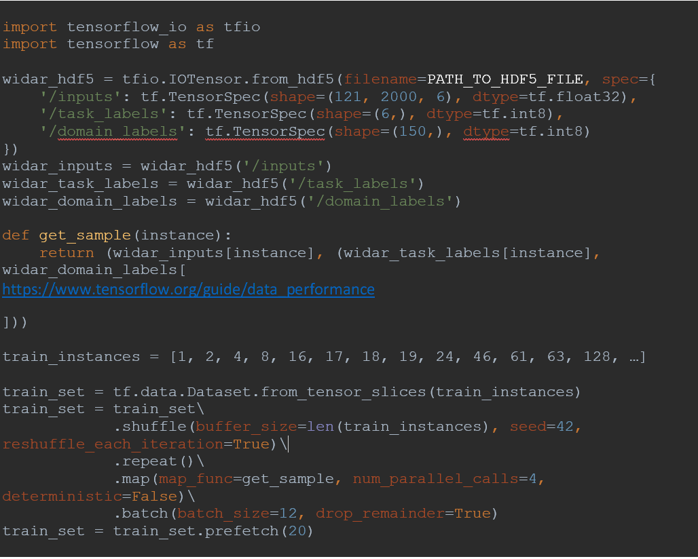
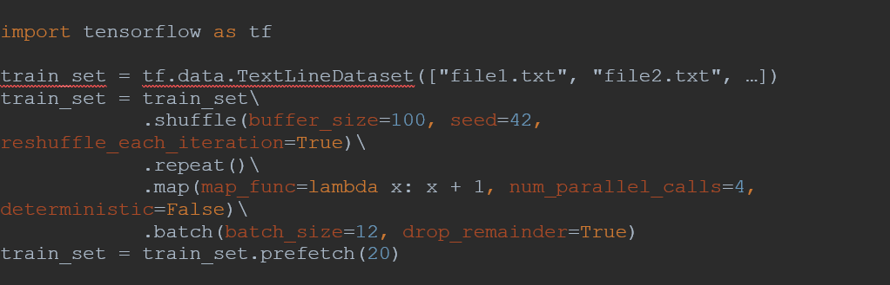

### Resources usage

Resource usage refers to the amount of CPU cores, RAM memory, GPUs, and
local SSD storage particular jobs scheduled at a GPU node use. GPU node
A contains 2 GPUs while GPU node B contains 8 GPUs. Every WIN HPC user
is allowed to use a maximum of 2 GPUs at any given time instant. This
allows multiple researchers to schedule experiments that will finish in
a reasonable amount of time. In case not many users are using WIN HPC,
we will be a bit more lenient with the GPU limit per user. If you have a
use case that requires more resources than WIN HPC can provide, we will
help you with getting into contact with the appropriate institutions
(e.g. SURF compute services or a third-party high performance cloud
computing service vendor) that can provide the resources required for
your use case. The allowed number of CPU cores, RAM memory, and local
SSD storage per GPU per node are listed in Table 1.

| Specs             | GPU Node A | GPU Node B |
|-------------------|------------|------------|
| CPU cores         | 8          | 7          |
| RAM memory        | 128 GB     | 32 GB      |
| Local SSD storage | 200 GB     | 500 GB     |

*Table 1. allowed number of CPU cores, RAM memory, and local SSD storage
per GPU per node*

In case you have a dataset that fits into local SSD storage, but cannot
be loaded completely into RAM according to the resource limits presented
in Table 1, please follow the instructions presented below for
dynamically buffering data from local SSD storage into RAM memory with a
particular experimentation framework of choice. In case no instructions
are provided for your experimentation framework of choice, feel free to
send us instructions via a Word or PDF document so that we can add the
instructions on this page.

<span style="color:red">Note: never buffer from the main storage node
via the head node!</span> Buffering from the main storage node will
cause the HPC to become unusable for everyone and is very slow because
data storage at the main storage node works via HDD technology. Before
you start with running your experiment scripts, first copy your dataset
from e.g. /home/mcs001/YOUR_USER_ID/DATASET_FOLDER to
/local/DATASET_FOLDER at the GPU node. Local SSD storage works via a
NVMe interface which is suitable for buffering which requires many IO
operations per second. When you have finished your experiments, please
remove your DATASET_FOLDER, including the data residing in this folder,
at the local SSD storage of the GPU node so that local storage does not
get clogged with stale datasets.

### Tensor flow

TensorFlow provides an input pipeline API called the tf.data API. There
are two ways in which data can be buffered dynamically into RAM memory:
either via loading many small files or slicing into a large file with a
file format that is supported by the TensorFlow I/O collection of file
systems and file formats. Examples are provided in Algorithms 1 and 2.
More information on how the specific functions listed in Algorithms 1
and 2 make sure that overall training time does not increase due to
buffering from local SSD storage can be found at the following

<figure markdown>
  
  <figcaption>Algorithm 1. Tf.data API example when slicing into a large HDF5 file</figcaption>
</figure>

<figure markdown>
  
  <figcaption>Algorithm 2. Tf.data API example when reading multiple text files</figcaption>
</figure>

### Job scheduling

Job scheduling at the GPU nodes needs to be done at least with the
following sbatch options:

```
#SBATCH --nodes
#SBATCH --ntasks
#SBATCH --partition
#SBATCH --error
#SBATCH --output
#SBATCH --time
#SBATCH --constraint
#SBATCH --gres
```

More information regarding the standard sbatch options can be found at
[Submit Jobs](../../steps/jobs/index.md). In this section,
we would like to put a bit more emphasis on the `--gres` option and why
it is a mandatory option. The `--gres` option causes the job scheduler
to change the environment variable `$CUDA_VISIBLE_DEVICES`. In this way,
you are always guaranteed exclusive access to a specific number of GPUs
requested via the `--gres` option, provided that everyone uses this
sbatch option. In case the `--gres` option is not used, the environment
variable is never changed, which results in several jobs running at the
GPU node that do not know of each other which GPU(s) they are accessing.
This in turn results in a high likelihood of encountering job crashes
caused by trying to allocate memory at a GPU of which all memory is
already allocated by another job.
