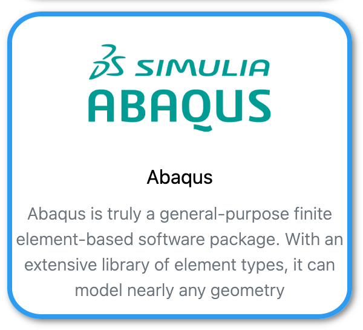

{: align=right style="height:150px"}

[Abaqus by 3DS](https://www.3ds.com/products-services/simulia/products/abaqus/){:target="_blank"}
is licensed software and only usable if the user is a member of the correct group.

## Using Abaqus interactive (Graphical User Interface)

Use your browser to connect to [Umbrella On Demand](https://hpc.tue.nl){:target="_blank"}

## Using Abaqus in SLURM batch jobs (Command Line Interface)

### Test Abaqus

Load the module(s)

```shell 
[user@umbrella]$ module purge
[user@umbrella]$ module load intel/2023a
[user@umbrella]$ module load Abaqus/2024
```

Check the fortran compiler

```shell
[user@umbrella]$ ifort --version
ifort (IFORT) 2021.9.0 20230302
Copyright (C) 1985-2023 Intel Corporation.  All rights reserved.
```

Check abaqus:

```shell 
[user@umbrella]$ abaqus verify -user_std
------------------------------------------------------------

Abaqus Product Verification

Wed 27 Mar 2024 01:05:06 PM CET

------------------------------------------------------------

Verify test : Abaqus/Standard with user subroutines verification

     result : PASS

------------------------------------------------------------

Verification procedure complete

Wed 27 Mar 2024 01:05:22 PM CET

------------------------------------------------------------
```

### Abaqus SLURM sbatch jobscript example using Shared Memory 

```
#!/bin/bash
#SBATCH --job-name=test_abaqus
#SBATCH --output=test_abaqus-%j.log
#SBATCH --partition=tue.default.q
#SBATCH --nodes=1
#SBATCH --ntasks=1
#SBATCH --cpus-per-task=4
#SBATCH --mem-per-cpu=2gb
#SBATCH --time=00:05:00

module purge
module load intel/2023a
module load Abaqus/2024

cd $HOME/Jobs/Abaqus

abaqus interactive job=${SLURM_JOB_NAME} cpus=${SLURM_CPUS_PER_TASK} mp-mode=threads input=boltpipeflange_3d_solidgask.inp 
```

