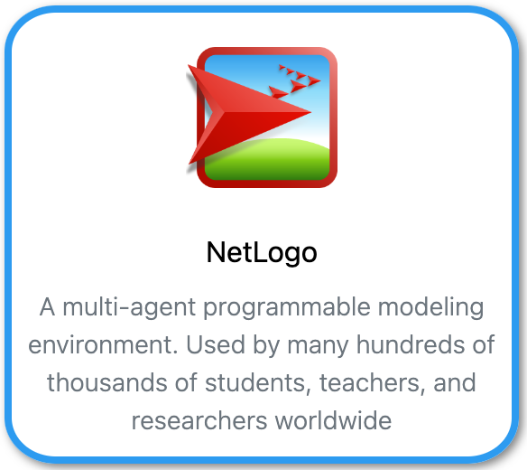

[NetLogo](https://ccl.northwestern.edu/netlogo/){:target="_blank"} is a multi-agent programmable modeling environment. It is used by many hundreds of thousands of students, teachers, and researchers worldwide.

{: align=right style="height:150px"}

## Using NetLogo interactive<br>(Graphical User Interface)

Use your browser to connect to [Umbrella On Demand](https://hpc.tue.nl){:target="_blank"}

## Using NetLogo in SLURM batch jobs<br>(Command Line Interface)

### Test NetLogo

Load the modules

``` shell
[user@umbrella]$ module purge
[user@umbrella]$ module load NetLogo/6.4.0-64
```
Check commandline version of NetLogo
```shell
[user@umbrella]$ netlogo-headless.sh --version
```

### NetLogo SLURM sbatch jobscript example using Shared Memory

```slurm
#!/bin/bash
#SBATCH --job-name=test_NetLogo
#SBATCH --output=test_NetLogo-%j.log
#SBATCH --partition=tue.default.q
#SBATCH --nodes=1
#SBATCH --ntasks=1
#SBATCH --cpus-per-task=4
#SBATCH --mem-per-cpu=1gb
#SBATCH --time=00:05:00

module purge
module load NetLogo/6.4.0-64

mdl="model.nlogo"
exp="experiment01"
tab="${exp}.csv"

srun netlogo-headless.sh --model "${mdl}" --experiment "${exp}" --tab "${tab}" --threads $SLURM_CPUS_PER_TASK
```
