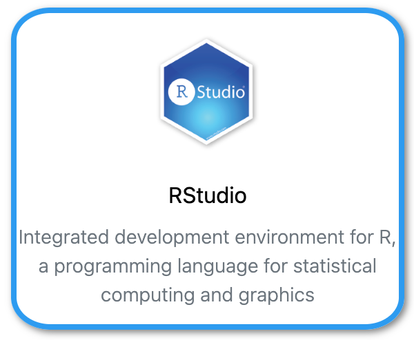

{: align=right style="height:150px"}

## Using R via Rstudio interactive (Graphical User Interface)

Use your browser to connect to [Umbrella On Demand](https://hpc.tue.nl){:target="_blank"}

## Using R in SLURM batch jobs (Command Line Interface)

### Test R

Load the module(s)

```shell 
[user@umbrella]$ module purge
[user@umbrella]$ module load R/4.4.0-gfbf-2023a
```

Check the version of R

```shell
[user@umbrella]$ R --version
R version 4.4.0 (2024-04-24) -- "Puppy Cup"
Copyright (C) 2024 The R Foundation for Statistical Computing
Platform: x86_64-pc-linux-gnu
...
```
Check Rscript
```shell
[user@umbrella]$ Rscript -e 'print("Hello!")'
[1] "Hello!"
```

### MATLAB SLURM sbatch jobscript example using 4 CPU

```slurm
#!/bin/bash
#SBATCH --job-name=test_r
#SBATCH --output=test_r-%j.log
#SBATCH --partition=tue.default.q
#SBATCH --nodes=1
#SBATCH --ntasks=1
#SBATCH --cpus-per-task=4
#SBATCH --mem-per-cpu=2gb
#SBATCH --time=00:05:00

module purge
module load R/4.4.0-gfbf-2023a

Rscript simple.r
```

??? example "simple.r"
  
    ```
    a=1;
    b=2;
    print(a + b);
    ```


## Package installation

The Comprehensive R Archive Network (CRAN) has packages available that
can be used to extend R. On the HPC cluster specific version of R can be
loaded using modules. Packages are installed **specific** for the version of
R that was active during install; when the version of R is changed the
packages need to be reinstalled.

Create a Rlibs directory in your home directory
```shell
mkdir Rlibs
```

Load the module with a s specific version of R
```shell
module load R/4.4.0-gfbf-2023a
```

Install a package and its dependency, in this example Rmpfr depends on gmp
```shell
Rscript -e "install.packages('gmp','~/Rlibs','http://ftp.ussg.iu.edu/CRAN')"
Rscript -e "install.packages('Rmpfr','~/Rlibs','http://ftp.ussg.iu.edu/CRAN')"
```

NOTE : In your job script, you **don't** need to install the package again! In the previous part you installed it in your home directory, which is also available on the compute nodes, hence the package is automatically also installed there.
