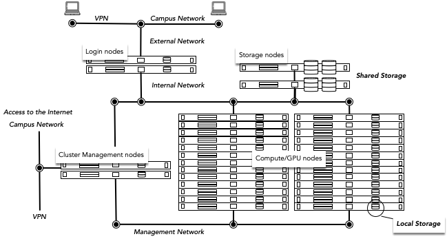

# Access the cluster

The TU/e Umbrella HPC Cluster is a Linux environment with shell (commandline) access and [web access](https://hpc.tue.nl).
To log in, one usually uses SSH to reach the respective Login Nodes (computers reserved for people just like you that 
want to connect to the HPC Cluster). This access is restricted, so you can only connect, when you are within the 
university/facility and its network. To still access the Login Nodes externally, you'll need to setup a VPN (Virtual Private Network) connection. 
Dedicated documentation on how to set this up is provided on the intranet
[VPN for employees](https://tuenl.sharepoint.com/sites/intranet-LIS/SitePages/VPN.aspx){:target=_blank} or 
[VPN for students](https://tuenl.sharepoint.com/sites/intranet-LIS/SitePages/Provisional-VPN-for-Students.aspx){:target=_blank}.
 
Once there, the user can interact with the system and run (small) programs to generally test the system/software.

There are currently two options to connect to the TU/e HPC Umbrella Cluster. Either by using a GUI/Website 
via [Open Ondemand](openondemand.md) ^(suggested)^ or through [SSH/Command Line](ssh.md).

<figure markdown>
  
  <figcaption>Infrastructure Overview</figcaption>
</figure>
