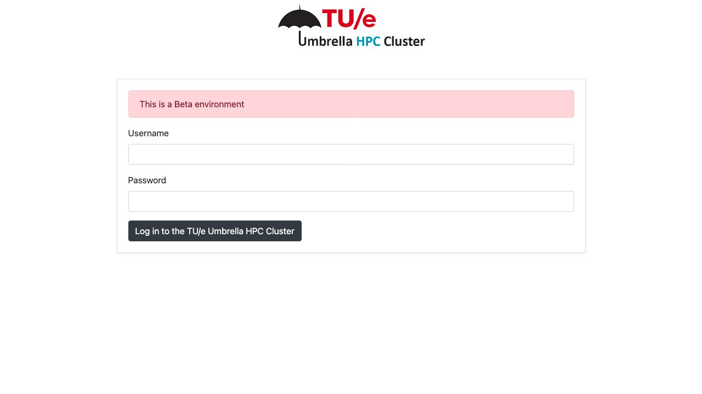
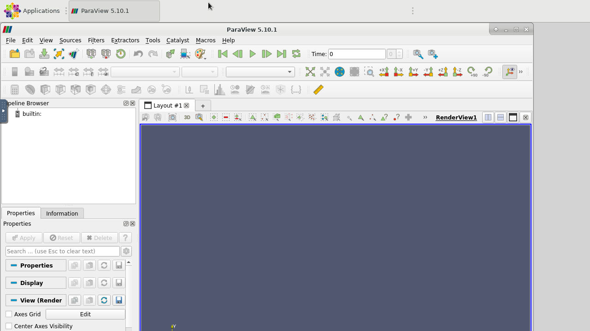

## Introduction

{ align=right width=250px }
Based on [openondemand.org](https://openondemand.org/){:target=_blank} easy access to the TU/e Umbrella HPC Cluster is possible using a web browser. To get started visit [hpc.tue.nl](https://hpc.tue.nl){:target=_blank} and login with your TU/e credentials.

 

## Terminal in the Browser

{ align=right width=250px }
Terminal access to the cluster login-node available from the browser, no longer client software is needed (other than a modern web browser) to take your first steps on the cluster!

 

## Upload and Download Files

{ align=right width=250px }
Access to the files with upload and download capabilities, in your home-directory on the cluster via the browser.

  

## Interactive Graphical Jobs

{ align=right width=250px }
Start interactive jobs in your browser with a few clicks and interact
within your browser.

    

various examples with Jupyter, Paraview and Matlab respectively.

{ width=225px }
{ width=225px }
{ width=225px }

!!! remark
This article is partially based on a [GitHub help article](https://help.github.com/en/github/authenticating-to-github/generating-a-new-ssh-key-and-adding-it-to-the-ssh-agent){:target=_blank}
