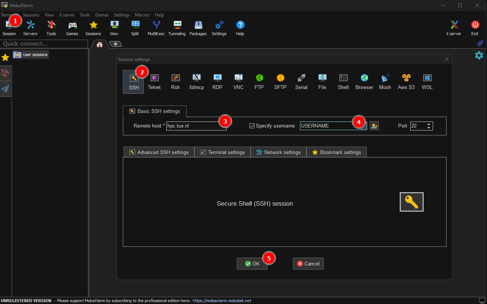
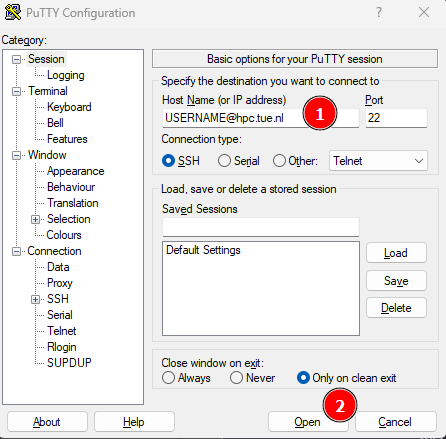
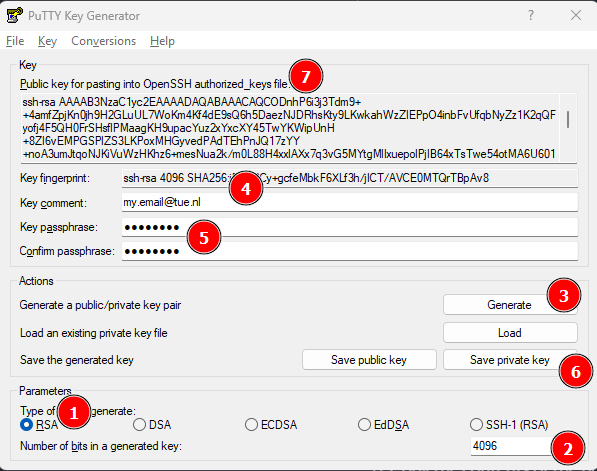
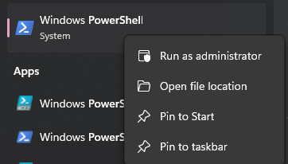

# SSH

## Introduction

HPC clusters that are most commonly operated via a [Command Line Interface (CLI)](https://en.wikipedia.org/wiki/Command-line_interface){:target=_blank}.

Such a CLI can be accessed directly by attaching a monitor and keyboard
to the cluster itself locally to create an operational "terminal",
however it is more common to operate HPC clusters remotely over the
(inter)network through [Secure SHell (SSH)](https://en.wikipedia.org/wiki/Secure_Shell){:target=_blank} 
using [Terminal Emulators](https://en.wikipedia.org/wiki/Terminal_emulator){:target=_blank}, as HPC clusters are usually geographically inconveniently located for their users.

GNU/Linux and MacOS systems are usually equipped with powerful SSH tools
by default out of the box. Microsoft Windows users can install openSSH
on windows
[1](https://docs.microsoft.com/en-us/windows-server/administration/openssh/openssh_install_firstuse),
or install third-party software, e.g.:

## Required Software

=== ":fontawesome-brands-windows: Windows"

    For Windows you likely need a 3rd party tool to be able to use SSH. More modern versions of Windows _may_ include SSH by default, for more information see [:simple-powershell: PowerShell](#__tabbed_2_3).

    === ":octicons-terminal-16: MobaXterm"

        Download and install the **free** version of [MobaXterm](https://mobaxterm.mobatek.net/download.html){:target=_blank}.  

    === ":material-network-pos: PuTTY"

        Download and install from [PuTTY](https://www.chiark.greenend.org.uk/~sgtatham/putty/latest.html){:target=_blank} from the *MSI ("Windows Installer")* section.

        !!! info "GUI applications/X11 forwarding"

            If you need to load X11/GUI applications from the terminal, please consider installing [VcXsrv](https://sourceforge.net/projects/vcxsrv/){:target=_blank} as well!

    === ":simple-powershell: PowerShell"

        SSH should be available by default for most Windows 11 installations. For windows 10 or manual installation please check the official [Microsoft documentation](https://learn.microsoft.com/en-us/windows-server/administration/openssh/openssh_install_firstuse?tabs=gui#install-openssh-for-windows){:target=_blank} on how to install SSH for Windows.

        !!! info
        
            You'll only need to install the "OpenSSH Client". Please **don't** install the "OpenSSH Server" if you don't know what you're doing!

        !!! info "GUI applications/X11 forwarding"

            If you need to load X11/GUI applications from the terminal, please consider installing [VcXsrv](https://sourceforge.net/projects/vcxsrv/){:target=_blank} as well!

=== ":fontawesome-brands-linux: Linux"

    ???- success "Available by default, no action required!"

        === ":fontawesome-brands-ubuntu: Ubuntu"
    
            ```shell
            apt install openssh-client
            ```
    
        === ":fontawesome-brands-debian: Debian"
    
            ```shell
            apt install openssh-client
            ```
    
        === ":fontawesome-brands-redhat: RHEL"
    
            ```shell
            dnf install openssh
            ```
    
        === ":simple-archlinux: Arch Linux"
    
            ```shell
            pacman -S openssh
            ```

=== ":fontawesome-brands-apple: MacOS"

    ???- success "Available by default, no action required!"

        === ":simple-homebrew: Homebrew"

            ```shell
            brew install openssh
            ```

## Logging in

=== ":fontawesome-brands-windows: Windows"

    === ":octicons-terminal-16: MobaXterm"

        { align=right width="300" } 

        Open MobaXterm.

        1. Click on Session (in top left menu)
        2. Select SSH within the "Session Settings" popup
        3. Fill in the Remote host: `hpc.tue.nl`
        4. Enter your TU/e login name
        5. Click on `Ok` to add the session and connect

    === ":material-network-pos: PuTTY"

        { align=right width="300" }

        Open PuTTY.

        1. Enter the "Host Name (or IP address)" field `USERNAME@hpc.tue.nl`
        2. Click on `Open` to connect to the server

    === ":simple-powershell: PowerShell"

         ```powershell
         > ssh USERNAME@hpc.tue.nl
         USERNAME@hpc.tue.nl's password:
         
                _____ _   _  __                                ╮╭
               |_   _| | | |/ /__                         ▄██████████▄
                 | | | |_| / / -_)                     ▄████████████████▄
                 |_|  \___/_/\___|                   ▄████████████████████▄
                                                   ▄██████████████████████▄
          Eindhoven University of Technology       ▐▀▀▀▀███▀▀▀▀██▀▀▀▀███▀▀▀▀▌
         ------------------------------------                  ▐▌
                                                               ▐▌  ▄
         Welcome to the TU/e HPC Umbrella login node           ▐▌  █
                                                                █▄█▀
         For WIKI information on how to use this cluster go to:
         https://hpcwiki.tue.nl/
          
         --------------------------------------------------------------------
          Data (incl. home directories) in the HPC Cluster is NOT backed up!
         
              The HPC Cluster is not a solution for archiving your work!
         --------------------------------------------------------------------
          
         [username@tue-login002 ~]$
         ```

=== ":fontawesome-brands-linux: Linux"

    ``` { .shell .annotate }
    $ ssh USERNAME@hpc.tue.nl
    USERNAME@hpc.tue.nl's password:
    
           _____ _   _  __                                ╮╭
          |_   _| | | |/ /__                         ▄██████████▄
            | | | |_| / / -_)                     ▄████████████████▄
            |_|  \___/_/\___|                   ▄████████████████████▄
                                               ▄██████████████████████▄
     Eindhoven University of Technology       ▐▀▀▀▀███▀▀▀▀██▀▀▀▀███▀▀▀▀▌
    ------------------------------------                  ▐▌
                                                          ▐▌  ▄
    Welcome to the TU/e HPC Umbrella login node           ▐▌  █
                                                           █▄█▀
    For WIKI information on how to use this cluster go to:
    https://hpcwiki.tue.nl/
    
    --------------------------------------------------------------------
     Data (incl. home directories) in the HPC Cluster is NOT backed up!
    
         The HPC Cluster is not a solution for archiving your work!
    --------------------------------------------------------------------
    
    [username@tue-login002 ~]$
    ```

=== ":fontawesome-brands-apple: MacOS"

    ``` { .shell .annotate }
    $ ssh USERNAME@hpc.tue.nl
    USERNAME@hpc.tue.nl's password:
    
           _____ _   _  __                                ╮╭
          |_   _| | | |/ /__                         ▄██████████▄
            | | | |_| / / -_)                     ▄████████████████▄
            |_|  \___/_/\___|                   ▄████████████████████▄
                                               ▄██████████████████████▄
     Eindhoven University of Technology       ▐▀▀▀▀███▀▀▀▀██▀▀▀▀███▀▀▀▀▌
    ------------------------------------                  ▐▌
                                                          ▐▌  ▄
    Welcome to the TU/e HPC Umbrella login node           ▐▌  █
                                                           █▄█▀
    For WIKI information on how to use this cluster go to:
    https://hpcwiki.tue.nl/
    
    --------------------------------------------------------------------
     Data (incl. home directories) in the HPC Cluster is NOT backed up!
    
         The HPC Cluster is not a solution for archiving your work!
    --------------------------------------------------------------------
    
    [username@tue-login002 ~]$
    ```

!!! info

    The USERNAME is equal to your TU/e network login name. This is usually a numeric value or starts with a `s` for students. Use the same password as the one you're using to log onto your TU/e account when prompted.

!!! note

    If you get a question about SSH key fingerprints from the server, you
    can verify them with the below values.

    ```shell
    2048 SHA256:1XsJDtOvF640B+woZx1i3Jg3H6IhyrLZSmcfbdpePYI hpc.tue.nl (RSA)
    256 SHA256:f397R3vn2cnR6gOq3FUwor3fs/ng0GOpA0pJva4L4Xg hpc.tue.nl (ECDSA)
    256 SHA256:czSbafxnFyq581Rvlrl4buHLjEApG5dBZkGfjy09HhI hpc.tue.nl (ED25519)
    ```

## Login nodes

Most TU/e HPC clusters are logged-into via the general log-in nodes from the TU/e: *hpc.tue.nl*, but some clusters have
their own login node:

| Hostname                  | Department                                 |
|---------------------------|--------------------------------------------|
| hpc.tue.nl ^(suggested)^  | -                                          |
| hpc.arch.tue.nl           | Built Environment (BE)                     |
| hpc.win.tue.nl            | Mathematics & Computer Science (M&CS)      |
| phys-login001.phys.tue.nl | Applied Physics & Science Education (APSE) |
| chem-login001.chem.tue.nl | Chemical Engineering & Chemistry (CE&C)    |

## Passwordless Authentication

To authenticate with the HPC cluster and verify that you are who you
claim you are (username), you provide a password. It is possible to use
an alternative setup, where the server verifies that you own the right
key. A key is, in the end, just a file on your computer, which can be
(should be) password protected. The
[idea](https://en.wikipedia.org/wiki/Public-key_cryptography){:target=_blank} is to
generate two files: a public key and a private key. You put the public
key on the server, and let the server verify that you own the private
key when logging in.

It is possible to copy the private key to other machines, so you have
access from all those machines. Alternatively, you can make separate key
pairs for all machines that need access to your account.

!!! danger

    NEVER share your private key with others! They will have access to all servers you use the SSH key for. 
    Prefer generating a new key pairs if necessary.

=== ":fontawesome-brands-windows: Windows"

    === ":octicons-terminal-16: MobaXterm"

        !!! success "Available by default, no action required!"

    === ":material-network-pos: PuTTY"

         { align=right width="250" } 

         Open the application PutTTYgen.

         1. Select `RSA` as key type
         2. Enter `4096` as number of bits to use (2048 by default).
         3. Click on Generate (and follow the instructions on screen)
         4. Enter your TU/e email address as Key comment
         5. Enter a passphrase for your key
         6. Save the private key to your computer (keep this file private!)

         7. Copy the contents of the public key into your keyboard
            1. Login into the HPC cluster (see [Logging In](#logging-in))
            2. Create the directory `~/.ssh` if not exists with `mkdir ~/.ssh`
            3. Open / Create the file `~/.ssh/authorized_keys`
            4. Paste the content of your clipboard into the `~/.ssh/authorized_keys` file (and save the file).

         Open the saved private key (step 6) with the Pageant program (enter the passphrase of Step 5 if prompted) and connect to the cluster as usual. You'll have to repeat this step everytime you reboot your system.

    === ":simple-powershell: PowerShell"

        { align=right width="200" }

         Open another Windows PowerShell as Administrator and enter the command below to enable and start the SSH agent

         ```powershell
         Get-Service ssh-agent | Set-Service -StartupType Automatic -PassThru | Start-Service
         ```

         Open Windows PowerShell as regular user.

         1. Generate a public/private key

             ```powershell
             ssh-keygen -t rsa -b 4096 -C "y.o.u.r.email@tue.nl"
             ```

         2. Upload your public key to the server
             To be able to use your SSH key pair to log in to the HPC cluster, you have to put your public key on the server.
      
             ```powershell
             ssh-copy-id USERNAME@hpc.tue.nl
             ```

         3. Add the SSH key to the agent
      
             ```powershell
             ssh-add
             ```

         4. Login into the cluster as usual (see [Logging In](#logging-in))

=== ":fontawesome-brands-linux: Linux"


    Open a terminal.

    1. Generate the public/private key

        ```shell
        ssh-keygen -t rsa -b 4096 -C "y.o.u.r.email@tue.nl"
        ```

        !!! info
      
            - You will be asked where to save the key pair. Accepting the default
            location by pressing enter is fine.
              - When prompted for a passphrase, enter the password that protects your
              key. It is possible to leave this empty, but we **_strongly_** recommend
              choosing a strong passphrase.


    2. Configure SSH config

        Add the following content to `~/.ssh/config`:
        ```shell
        Host *
          AddKeysToAgent yes
          UseKeychain yes
          IdentityFile ~/.ssh/id_rsa
        ```
    
        !!! info
    
            Then add your key (we use the default key location here, you may have to change this location if you picked a non-default one):

    3. Putting your public key on the HPC cluster
   
        To be able to use your SSH key pair to log in to the HPC cluster, you
        have to put your public key on the server.
   
        ```shell
        ssh-copy-id USERNAME@hpc.tue.nl
        ```

    4. Add the SSH key to the agent
   
        ```shell
        ssh-add
        ```
   
    5. Login into the cluster as usual (see [Logging In](#logging-in))


=== ":fontawesome-brands-apple: MacOS"


    Open a terminal.

    1. Generate the public/private key

        ```shell
        ssh-keygen -t rsa -b 4096 -C "y.o.u.r.email@tue.nl"
        ```

        !!! info
      
            - You will be asked where to save the key pair. Accepting the default
            location by pressing enter is fine.
              - When prompted for a passphrase, enter the password that protects your
              key. It is possible to leave this empty, but we **_strongly_** recommend
              choosing a strong passphrase.


    2. Configure SSH config

        Add the following content to `~/.ssh/config`:
        ```shell
        Host *
          AddKeysToAgent yes
          UseKeychain yes
          IdentityFile ~/.ssh/id_rsa
        ```
    
        !!! info
    
            Then add your key (we use the default key location here, you may have to change this location if you picked a non-default one):

    3. Putting your public key on the HPC cluster
   
        To be able to use your SSH key pair to log in to the HPC cluster, you
        have to put your public key on the server.
   
        ```shell
        ssh-copy-id USERNAME@hpc.tue.nl
        ```
   
    4. Add the SSH key to the agent
   
        ```shell
        ssh-add
        ```
   
    5. Login into the cluster as usual (see [Logging In](#logging-in))