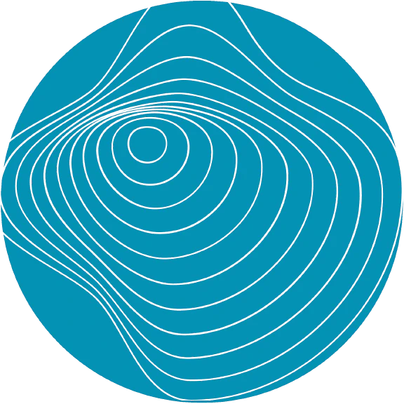

---
hide:
  - navigation
  - toc
title: Home
template: intro.html
---

# Simulation and AI
{ align=right width="200" }
The HPC Lab at the TU/e helps engineers, students and scientists with HPC application optimization and to pick the best-fit infrastructure to solve their questions. The aim is to broaden and deepen the use of HPC to advance science & engineering and to strengthen the HPC community.

**[Join our HPC Supercomputing community at LinkedIn →](https://www.linkedin.com/in/supercomputing/){:target="_blank" }**

## Getting Started
Do you need to make big computations for your research or educational work? Like, more than 12 hours of computation time on your laptop or workstation? And are you struggling or spending too much time? Then, likely there is a faster, easier solution.

Maybe the TU/e HPC Lab can help!

So, wait no longer and call us for speeding up your computations in Simulation and AI! We can be reached through e-mail at **[supercomputing@tue.nl](mailto:supercomputing@tue.nl)** or phone at **[(040 247) 2010](tel:+31402472010)**. Or you can visit us soon at the [EAISI institute](https://www.tue.nl/en/research/institutes/eindhoven-artificial-intelligence-systems-institute){:target="_blank"} in the Neuron building at TU/e Campus.

## Solutions
{ align=right width="600" loading=lazy }
At TU/e, there are multiple types of HPC infrastructure available, each with their own characteristics and target group.
The staircase model (see picture above) represents the vision of TU/e regarding HPC. There is not one solution for High Performance Computing. Depending on the scale of the simulations and resources, know-how and money available, an HPC user normally starts somewhere on this staircase. As during time the scale of the simulations increases, sometimes another staircase is needed. We can help and support you.
