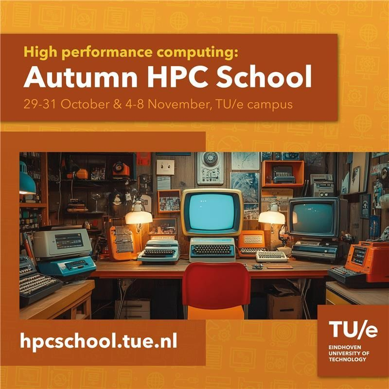

# Autumn HPC School

{ align=right width=250px }

Supercomputing at the Autumn HPC School! This 2-week program is perfect for students and researchers keen to explore the world of AI and high-performance computing. Join us for our excellent keynotes and workshops and unlock the power of HPC.

This event is free of charge with only limited seats available, please register yourself quickly if you're interested! This Autumn HPC School is made possible through the collaboration between the Eindhoven Supercomputing Center - HPC Lab, [SURF](https://surf.nl){ target=_blank } & [EuroCC Netherlands](https://eurocc-netherlands.nl/what-is-eurocc/){ target=_blank }.

Register here: [https://hpcschool.tue.nl](https://hpcschool.tue.nl/){target=_blank}
